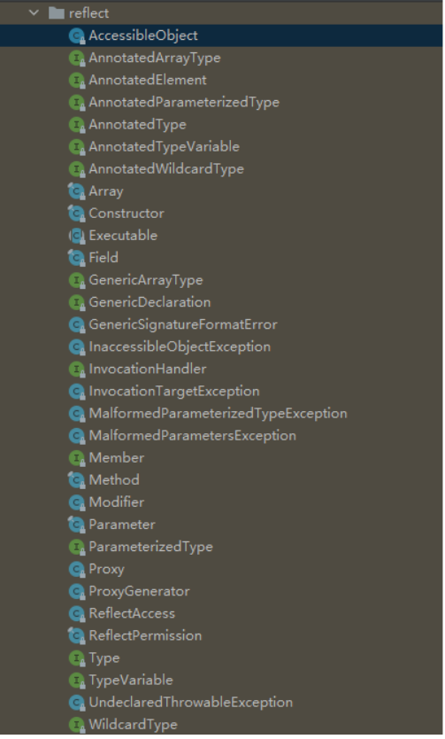

#java反射

> Java 反射是 Java 被视为动态语言的一个关键性质。这个机制允许程序在运行时透过 Reflection APIs 取得任何一个已知名称的 class 的内部信息，包括其modifiers（诸如 public, static 等）、superclass（例如 Object）、实现之interfaces（例如 Cloneable），也包括 fields 和 methods 的所有信息，并可于运行时改变 fields 内容或唤起 methods。



RTTI

运行期类型鉴定（RTTI）的概念

## 使用场景

- 开发通用框架 - 反射最重要的用途就是开发各种通用框架。

- 动态代理 - 在切面编程（AOP）中，需要拦截特定的方法，通常，会选择动态代理方式

- 注解 - 注解本身仅仅是起到标记作用，它需要利用反射机制，根据注解标记去调用注解解释器，执行行为。

### 类加载的完整过程如下：

1. 在编译时，Java 编译器编译好 .java 文件之后，在磁盘中产生 .class 文件。.class 文件是二进制文件，内容是只有 JVM 能够识别的机器码。
2. JVM 中的类加载器读取字节码文件，取出二进制数据，加载到内存中，解析.class 文件内的信息。类加载器会根据类的全限定名来获取此类的二进制字节流；然后，将字节流所代表的静态存储结构转化为方法区的运行时数据结构；接着，在内存中生成代表这个类的 java.lang.Class 对象。
3. 加载结束后，JVM 开始进行连接阶段（包含验证、准备、初始化）。经过这一系列操作，类的变量会被初始化。

##反射方式

- 调 用getClass()
- 运行 .class语法
- 运行Class.forName()

##java字段反射

Fields类

```
public Field getField(String name)  
	返回一个 Field 对象，它反映此 Class 对象所表示的类或接口的指定公共成员字段
public Field[] getFields() 
	返回一个包含某些 Field 对象的数组，这些对象反映此 Class 对象所表示的类或接口的所有可访问公共字段
public Field getDeclared Field(String name) 
	返回一个 Field 对象，该对象反映此 Class 对象所表示的类或接口的指定已声明字段
public Field[] getDeclaredFields()  
	返回 Field 对象的一个数组，这些对象反映此 Class 对象所表示的类或接口所声明的所有字段

getFields 和 getDeclaredFields 区别：
getFields 返回的是申明为 public 的属性，包括父类中定义，
getDeclaredFields 返回的是指定类定义的所有定义的属性，不包括父类的

```

##java方法反射

```
public Method getMethod(String name, Class<?>... parameterTypes)  
	返回一个 Method 对象，它反映此 Class 对象所表示的类或接口的指定公共成员方法。
public  Method[] getMethods() 
	返回一个包含某些 Method 对象的数组，这些对象反映此 Class 对象所表示的类或接口（包括那些由该类或接口声明的以及从超类和超接口继承的那些的类或接口）的公共 member 方法。
public MethodgetDeclaredMethod(Stringname,Class<?>... parameterTypes)  
	返回一个 Method 对象，该对象反映此 Class 对象所表示的类或接口的指定已声明方法
public  Method[] getDeclaredMethods()  
	返回 Method 对象的一个数组，这些对象反映此 Class 对象表示的类或接口声明的所有方法，包括公共、保护、默认（包）访问和私有方法，但不包括继承的方法。
```

##java构造函数反射

通过反射机制得到某个类的构造器，然后调用该构造器创建该类的一个实例
Class<T>  类提供了几个方法获取类的构造器。

```
public Constructor<T> getConstructor(Class<?>... parameterTypes)
	返回一个 Constructor 对象，它反映此 Class 对象所表示的类的指定公共构造方法
public Constructor<?>[] getConstructors() 
	返回一个 Constructor 对象，该对象反映此 Class 对象所表示的类或接口的指定构造方法。
public Constructor<T> getDeclaredConstructor(Class<?>... parameterTypes) 
	返回一个 Constructor 对象，该对象反映此 Class 对象所表示的类或
接口的指定构造方法
public Constructor<?>[] getDeclaredConstructors() 
	返回 Constructor 对象的一个数组，这些对象反映此 Class 对象表示的类声明的所有构造方法。它们是公共、保护、默认（包）访问和私有构造方法
```

##java反射对象创建

- 调用类的 Class 对象的 newInstance 方法，该方法会调用对象的默认构造器，如果没有默认构造器，会调用失败

  ```java
  Class<?> classType = ExtendType.class;
  Object inst = classType.newInstance();
  ```

- 调用默认 Constructor 对象的 newInstance 方法

  ```java
  Class<?> classType = ExtendType.class;
  Constructor<?>constructor=classType.getConstructor();
  Object inst = constructor1.newInstance();
  ```

- 调用带参数 Constructor 对象的 newInstance 方法

  ```
  Constructor<?> constructor2 =classType.getDeclaredConstructor(int.class, String.class);
  Object inst = constructor2.newInstance(1, "123");
  ```

#使用反射的缺点

##性能

​		反射包括了一些动态类型，所以 JVM 无法对这些代码进行优化。因此，反射操作的效率要比那些非反射操作低得多。我们应该避免在经常被 执行的代码或对性能要求很高的程序中使用反射。

##安全限制

​		使用反射技术要求程序必须在一个没有安全限制的环境中运行。如果一个程序必须在有安全限制的环境中运行。

##内部暴露

​		由于反射允许代码执行一些在正常情况下不被允许的操作（比如访问私有的属性和方法），所以使用反射可能会导致意料之外的副作用－－代码有功能上的错误，降低可移植性。反射代码破坏了抽象性，因此当平台发生改变的时候，代码的行为就有可能也随着变化。


笨神https://mp.weixin.qq.com/s/5H6UHcP6kvR2X5hTj_SBjA